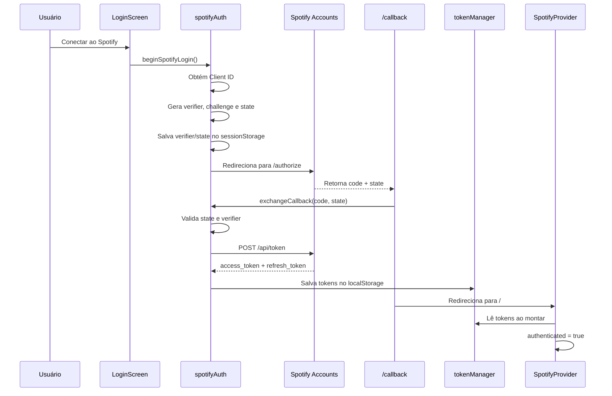
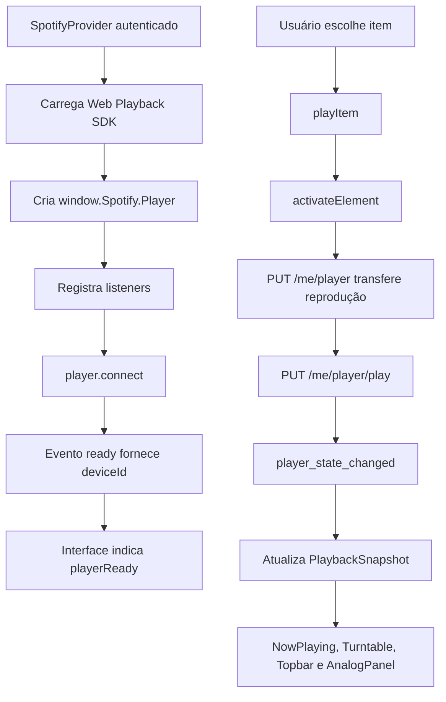

# Arquitetura do Visual SpotyMusic

> Documento gerado a partir da análise estática do repositório `visual-spotymusic` na versão 2.3.0. Nenhuma funcionalidade da aplicação foi alterada. A validação de tipos foi executada com `npx tsc --noEmit` e terminou sem erros.

## 1. Visão geral

O Visual SpotyMusic é uma aplicação cliente construída com Next.js 16, React 19 e TypeScript. O projeto usa o App Router, gera uma exportação estática (`output: "export"`) e concentra a integração com Spotify em um provider React executado no navegador.

As responsabilidades principais estão distribuídas assim:

- `app/`: rotas, layout global, metadados e CSS global;
- `components/`: interface, toca-discos, player, biblioteca, login e publicidade;
- `context/`: estado global e orquestração da integração com o Spotify;
- `hooks/`: acesso ao contexto e animações do vinil e do braço;
- `services/`: OAuth PKCE, tokens, Web API e carregamento do Web Playback SDK;
- `types/`: tipos locais do domínio Spotify;
- `worker/`: entrega dos arquivos estáticos e exposição do Client ID público em produção;
- `public/`: manifesto, robots e imagem social.

Não existe Tailwind no projeto. Toda a estilização está em `app/globals.css`.

## 2. Estrutura de pastas e arquivos

```text
visual-spotymusic/
├── .git/                         # Metadados locais do Git
├── .next/                        # Saída gerada pelo Next.js (não versionada)
├── .openai/
│   └── hosting.json              # Identificador do projeto de hospedagem
├── app/
│   ├── callback/
│   │   └── page.tsx              # Retorno do OAuth Spotify
│   ├── privacy/
│   │   └── page.tsx              # Política de privacidade
│   ├── globals.css               # Todos os estilos globais e responsivos
│   ├── layout.tsx                # Layout raiz, metadados e script do AdSense
│   └── page.tsx                  # Página principal e montagem do provider
├── components/
│   ├── AdSlot.tsx
│   ├── AnalogPanel.tsx
│   ├── AppShell.tsx
│   ├── ErrorToast.tsx
│   ├── Icon.tsx
│   ├── Knob.tsx
│   ├── LibraryList.tsx
│   ├── LoginScreen.tsx
│   ├── NowPlaying.tsx
│   ├── PlaybackControls.tsx
│   ├── ProgressBar.tsx
│   ├── Search.tsx
│   ├── Sidebar.tsx
│   ├── SpotifyCallback.tsx
│   ├── Tonearm.tsx
│   ├── Topbar.tsx
│   ├── Turntable.tsx
│   ├── VUMeter.tsx
│   ├── Vinyl.tsx
│   └── VolumeControl.tsx
├── context/
│   └── SpotifyProvider.tsx       # Estado e casos de uso centrais
├── hooks/
│   ├── useLibrary.ts
│   ├── usePlaybackState.ts
│   ├── useSpotifyAuth.ts
│   ├── useSpotifyPlayer.ts
│   ├── useTonearmProgress.ts
│   └── useVinylAnimation.ts
├── node_modules/                 # Dependências instaladas (não versionadas)
├── out/                          # Exportação estática gerada (não versionada)
├── public/
│   ├── og.png                    # Imagem Open Graph
│   ├── robots.txt
│   └── site.webmanifest
├── services/
│   ├── spotifyApi.ts             # Cliente HTTP da Spotify Web API
│   ├── spotifyAuth.ts            # OAuth Authorization Code com PKCE
│   ├── spotifyPlayer.ts          # Carregamento do Web Playback SDK
│   └── tokenManager.ts           # Persistência dos tokens no localStorage
├── types/
│   └── spotify.ts                # Tipos de faixa, biblioteca, player e tokens
├── worker/
│   └── index.js                  # Worker de assets e spotify-config.json
├── .env.example                  # Variáveis públicas esperadas
├── .gitignore
├── ANUNCIOS.md
├── PUBLICACAO-CHATGPT-SITES.md
├── README.md
├── VALIDACAO-v2.2.0.md
├── next-env.d.ts                 # Gerado pelo Next.js
├── next.config.ts                # Strict Mode e exportação estática
├── package-lock.json
├── package.json
└── tsconfig.json
```

As pastas `.next/`, `node_modules/` e `out/` foram consideradas no inventário, mas seus arquivos internos não são listados porque são artefatos gerados ou dependências de terceiros, não arquitetura autoral do projeto.

## 3. Páginas e rotas

O projeto usa exclusivamente o App Router. Não existe pasta `pages/`.

| Rota | Arquivo | Responsabilidade |
|---|---|---|
| `/` | `app/page.tsx` | Monta `SpotifyProvider` e `AppShell`. |
| `/callback` | `app/callback/page.tsx` | Monta `SpotifyCallback`, valida o retorno do OAuth e troca o código por tokens. |
| `/privacy` | `app/privacy/page.tsx` | Exibe a política de privacidade e instruções de revogação. |

`app/layout.tsx` é o layout raiz. Ele:

- define `lang="pt-BR"`;
- importa `app/globals.css`;
- publica metadados, Open Graph, Twitter Card e manifesto;
- injeta o script do Google AdSense somente quando `NEXT_PUBLIC_ADSENSE_CLIENT_ID` está configurado.

## 4. Componentes React

Foram encontrados 20 componentes React.

| Componente | Responsabilidade | Consumido por |
|---|---|---|
| `AppShell` | Decide entre loading, login e aplicação autenticada; controla abertura da sidebar e atalho global de espaço. | `app/page.tsx` |
| `LoginScreen` | Tela desautenticada, login Spotify, modo demonstração, privacidade e anúncios. | `AppShell` |
| `SpotifyCallback` | Processa `code`, `state` ou erro do retorno OAuth e redireciona para `/`. | `app/callback/page.tsx` |
| `Sidebar` | Navegação, categorias, pesquisa, detalhes, lista da biblioteca, perfil e logout. | `AppShell` |
| `Topbar` | Menu, anterior/próxima, faixa atual, status e avatar. | `AppShell` |
| `Turntable` | Estrutura do toca-discos, RPM, botão de energia, vinil e braço. | `AppShell` |
| `Vinyl` | Renderiza o disco, a capa central e aplica a rotação. | `Turntable` |
| `Tonearm` | Renderiza o conjunto do braço e aplica o ângulo calculado. | `Turntable` |
| `NowPlaying` | Capa, faixa, artista, álbum, curtir, progresso, controles e volume. | `AppShell` |
| `PlaybackControls` | Shuffle, anterior, play/pause, próxima e repeat. | `NowPlaying` |
| `ProgressBar` | Slider de progresso e formatação dos tempos. | `NowPlaying` |
| `VolumeControl` | Mute e slider de volume. | `NowPlaying` |
| `AnalogPanel` | Painel visual com VU meters e knobs. | `AppShell` |
| `VUMeter` | Anima uma agulha sintética para os canais L/R. | `AnalogPanel` |
| `Knob` | Controle visual por arraste vertical ou teclado. | `AnalogPanel` |
| `Search` | Campo controlado de busca no Spotify. | `Sidebar` |
| `LibraryList` | Lista reutilizável de faixas, álbuns, artistas ou playlists. | `Sidebar` |
| `Icon` | Mapa centralizado de glifos textuais usados na navegação. | `AppShell`, `Sidebar` |
| `ErrorToast` | Mostra e limpa erros globais automaticamente ou por clique. | `AppShell` |
| `AdSlot` | Renderiza um slot AdSense configurado ou um placeholder. | `LoginScreen` |

### Componentes não utilizados

Nenhum dos 20 componentes está órfão: todos possuem ao menos um consumidor no grafo de imports atual.

Existem, porém, opções não utilizadas dentro de `Icon`: os nomes `search`, `heart` e `user` estão no mapa, mas não são solicitados por nenhum componente. Eles podem ser removidos ou preservados como catálogo planejado.

Também existem controles visíveis sem comportamento implementado: os botões `Explorar` e `Rádio` de `Sidebar` não possuem `onClick`. Eles não são componentes mortos, mas são interface inativa.

## 5. Hooks

| Hook | Função | Situação |
|---|---|---|
| `useSpotifyAuth` | Valida e retorna o `SpotifyContext`. É o acesso principal a todo o estado global. | Usado amplamente. |
| `useSpotifyPlayer` | Reexporta `useSpotifyAuth` com outro nome. | Não utilizado. |
| `usePlaybackState` | Retorna somente `playback` a partir do contexto. | Usado por `AnalogPanel`. |
| `useLibrary` | Retorna `library`, `loadLibrary` e `search`. | Não utilizado. |
| `useVinylAnimation` | Mantém o ângulo do disco e atualiza `transform` com `requestAnimationFrame`. | Usado por `Vinyl`. |
| `useTonearmProgress` | Converte progresso da faixa em ângulo do braço. | Usado por `Tonearm`. |

`useSpotifyPlayer` e `useLibrary` são candidatos claros a remoção ou adoção consistente pelos componentes.

## 6. Contextos e providers

Existe um único contexto: `SpotifyContext`, criado e fornecido por `SpotifyProvider`.

O provider concentra, em 229 linhas, as seguintes responsabilidades:

- restauração da sessão;
- perfil do usuário;
- inicialização e ciclo de vida do Web Playback SDK;
- sincronização periódica com `/me/player`;
- estado de reprodução;
- modo demonstração e relógio simulado;
- carregamento da biblioteca;
- carregamento de detalhes;
- pesquisa;
- ativação do dispositivo;
- reprodução de contextos ou faixas;
- play/pause, anterior, próxima, seek e volume;
- shuffle e repeat;
- consulta e alteração de curtidas;
- logout;
- erros globais.

### Estado exposto

- autenticação: `authenticated`, `demo`, `ready`, `profile`;
- dispositivo: `playerReady`, `deviceId`;
- reprodução: `playback`, `liked`;
- dados: `library`;
- ações: `login`, `enterDemo`, `logout`, `loadLibrary`, `loadDetails`, `search`, `playItem`, `activateDevice`, `toggle`, `previous`, `next`, `seek`, `setVolume`, `setShuffle`, `setRepeat`, `toggleLike`;
- erro: `error`, `clearError`.

Como o valor inteiro está em um único contexto e `playback.position` muda frequentemente, qualquer consumidor do contexto pode renderizar novamente mesmo quando não usa o progresso da música.

## 7. Serviços e integração externa

### `spotifyAuth.ts`

Implementa Authorization Code com PKCE, sem Client Secret no navegador.

- gera `code_verifier`, `code_challenge` SHA-256 e `state`;
- guarda verifier e state no `sessionStorage`;
- monta a autorização em `https://accounts.spotify.com/authorize`;
- troca o código por tokens em `https://accounts.spotify.com/api/token`;
- renova o access token com o refresh token;
- obtém o Client ID por variável de ambiente ou `/spotify-config.json`.

### `tokenManager.ts`

Persiste `accessToken`, `refreshToken` e `expiresAt` no `localStorage`. Um token é considerado válido somente se continuar válido por mais 30 segundos.

### `spotifyApi.ts`

É o cliente central da Web API:

- acrescenta o Bearer token;
- renova o token antes da chamada quando necessário;
- tenta novamente uma vez após HTTP 401;
- traduz 403 e 404 em mensagens específicas;
- trata respostas 204 e corpos vazios.

### `spotifyPlayer.ts`

Carrega dinamicamente `https://sdk.scdn.co/spotify-player.js` e aguarda `window.onSpotifyWebPlaybackSDKReady`.

A função exportada `activatePlayer` não é utilizada. O provider chama `player.activateElement()` diretamente.

### `worker/index.js`

O worker:

- responde `/spotify-config.json` com o Client ID público recebido do ambiente;
- entrega os arquivos da exportação estática por `env.ASSETS`;
- tenta resolver rotas sem extensão como arquivos `.html` quando o primeiro fetch retorna 404.

## 8. Fluxo completo do login Spotify



### Detalhes do fluxo

1. `AppShell` espera `ready` do provider.
2. Sem tokens, renderiza `LoginScreen`.
3. `LoginScreen.connect` chama `login`, que aponta para `beginSpotifyLogin`.
4. O Client ID vem primeiro de `NEXT_PUBLIC_SPOTIFY_CLIENT_ID`; se ausente, de `/spotify-config.json`.
5. A Redirect URI vem de `NEXT_PUBLIC_SPOTIFY_REDIRECT_URI` ou de `${window.location.origin}/callback`.
6. O Spotify devolve o usuário para `/callback`.
7. `SpotifyCallback` valida parâmetros e chama `exchangeCallback`.
8. Os tokens são salvos e a página volta para `/` com `window.location.replace`.
9. `SpotifyProvider` encontra os tokens, marca a sessão como autenticada e inicializa perfil e player.
10. Antes de cada Web API call, `spotifyApi` valida a expiração e tenta renovar o token.
11. `logout` remove os tokens e reinicia estado de autenticação, perfil, demo e playback.

### Escopos solicitados

- `user-read-private`;
- `user-read-email`;
- `streaming`;
- `user-read-playback-state`;
- `user-modify-playback-state`;
- `user-library-read`;
- `user-library-modify`;
- `playlist-read-private`;
- `user-follow-read`;
- `user-read-currently-playing`.

## 9. Fluxo do player



### Inicialização

- O provider busca `/me` e carrega o SDK após autenticação.
- O player é criado com nome `Visual SpotyMusic`, callback de access token e volume inicial.
- O evento `ready` salva o `deviceId`; `not_ready` o limpa.
- Erros de autenticação, conta e reprodução vão para o erro global.
- `player_state_changed` converte a faixa do SDK para o tipo local e atualiza playback.

### Sincronização

Além dos eventos do SDK, o provider consulta `/me/player` imediatamente e a cada 6 segundos. Essa consulta recupera faixa, posição, duração, shuffle e repeat. Falhas são ignoradas porque o SDK permanece a fonte principal.

### Reprodução de um item

- Faixa: envia `{ uris: [item.uri] }`.
- Álbum, playlist ou artista: envia `{ context_uri: item.uri }`.
- Antes de tocar, ativa o elemento, transfere o dispositivo com `PUT /me/player`, aguarda 300 ms e chama `/me/player/play` com o `device_id`.

### Controles

- play/pause, anterior, próxima, seek e volume usam diretamente o Web Playback SDK;
- shuffle e repeat usam a Web API;
- curtir consulta `/me/library/contains` e usa `PUT` ou `DELETE` em `/me/library`;
- `Space` aciona play/pause globalmente fora de inputs e botões;
- em modo demonstração, o provider simula faixa, posição, troca e controles, sem áudio.

## 10. Fluxo da biblioteca

`Sidebar` mantém estado local para categoria ativa, busca, resultados, item detalhado e loading dos detalhes.

### Categorias e endpoints

| Categoria | Endpoint | Normalização |
|---|---|---|
| Playlists | `/me/playlists?limit=30` | Nome, imagem, URI e total de faixas. |
| Álbuns | `/me/albums?limit=30` | Extrai `raw.album`, artistas e imagem. |
| Artistas | `/me/following?type=artist&limit=30` | Lê `data.artists.items`. |
| Músicas | `/me/tracks?limit=30` | Extrai `raw.track` e usa `mapTrack`. |

Ao trocar de categoria, um efeito chama `loadLibrary(active)`. O resultado é salvo em `library[category]`.

### Busca

1. `Search` atualiza `query`.
2. `Sidebar` espera 350 ms.
3. Com texto não vazio, chama `/search` para `track,artist,album,playlist`, com limite 8 por tipo.
4. Os quatro grupos são normalizados e achatados para exibição em `LibraryList`.
5. Ao limpar o texto, a categoria ativa volta a ser exibida.

### Detalhes

- faixa: toca imediatamente;
- playlist: consulta `/playlists/{id}/items?limit=50`, remove episódios e normaliza faixas;
- álbum: consulta `/albums/{id}` e injeta os metadados do álbum em cada faixa;
- artista: pesquisa até 10 faixas com `artist:{nome}`.

`LibraryList` é compartilhado entre a listagem principal e a listagem de detalhes.

## 11. Animação do toca-discos

O toca-discos é formado por `Turntable`, `Vinyl` e `Tonearm`, com estrutura e aparência definidas em CSS.

### Rotação do vinil

`Turntable` guarda o RPM localmente como `33 | 45` e passa o valor, junto de `playback.isPlaying`, para `Vinyl`.

`Vinyl` chama `useVinylAnimation`, que:

1. mantém uma referência ao elemento e outra ao ângulo acumulado;
2. inicia um loop com `requestAnimationFrame`;
3. quando `playing` é verdadeiro, soma ao ângulo `(tempoDecorrido × rpm × 0.006)`;
4. normaliza o resultado entre 0 e 359 graus;
5. escreve diretamente `style.transform = rotate(...)`;
6. conserva o ângulo ao pausar, permitindo retomar do ponto visual anterior;
7. cancela o frame no cleanup do efeito.

A capa da faixa aparece no rótulo central do disco. Sem capa, é exibido o rótulo visual padrão.

O CSS usa gradientes radiais e cônicos para sulcos, brilho, label, prato e perspectiva. Em `prefers-reduced-motion: reduce`, a transformação do vinil é desabilitada.

## 12. Funcionamento do braço do toca-discos

`Tonearm` recebe posição, duração e existência de uma faixa. `useTonearmProgress` calcula o ângulo:

```text
sem faixa: -23°
com faixa: -7° + clamp(position / duration, 0..1) × 18°
```

Portanto:

- sem faixa, o braço fica no descanso;
- no início da música, fica aproximadamente em `-7°`;
- durante a faixa, percorre linearmente 18 graus;
- no fim, chega aproximadamente a `11°`.

O ângulo é aplicado inline ao elemento `.tonearm`. O CSS define `transform-origin: 50% 2%` e uma transição de 0,8 segundo, suavizando as atualizações periódicas de posição.

O movimento é apenas uma representação visual do progresso; não controla a posição da música diretamente.

## 13. CSS e Tailwind

### Arquivos encontrados

- `app/globals.css`: único arquivo CSS autoral, com 396 linhas físicas e grande quantidade de regras comprimidas na mesma linha;
- não existe `tailwind.config.*`;
- não existe `postcss.config.*`;
- não existem CSS Modules;
- não existe CSS-in-JS, além de variáveis CSS inline usadas para progresso e ângulo de knobs.

### Organização atual do CSS

O arquivo reúne:

- tokens globais;
- login, callback e loading;
- sidebar e biblioteca;
- toca-discos, vinil e braço;
- painel da faixa atual;
- controles e painel analógico;
- responsividade;
- movimento reduzido;
- duas camadas posteriores de redesign, identificadas pelos comentários “equipamento premium” e “Visual 2.1”;
- página jurídica;
- publicidade da tela de login.

### CSS duplicado e sobreposto

Há duplicação estrutural significativa. O mesmo seletor é definido primeiro no tema base e redefinido nas camadas posteriores; parte dessas redefinições também reaparece dentro de múltiplos media queries.

Seletores com maior número de ocorrências na análise textual:

| Seletor | Ocorrências |
|---|---:|
| `.studio` | 9 |
| `.analog-panel` | 8 |
| `.top-grid` | 8 |
| `.now-playing` | 8 |
| `.deck` | 8 |
| `.album-art` | 7 |
| `.sidebar` | 6 |
| `.track-info h3` | 6 |
| `.platter` | 5 |
| `.tonearm-assembly` | 5 |
| `.studio-topbar` | 4 |
| `.vinyl` | 4 |
| `.vu-meter` | 4 |
| `.playback-controls .main-play` | 4 |

Nem toda repetição é incorreta: regras dentro de breakpoints são esperadas. O problema principal é a coexistência de três versões do tema no mesmo arquivo, dependendo da ordem da cascata para anular estilos anteriores. Isso aumenta especificidade acidental, dificulta prever o resultado e mantém declarações que já não têm efeito.

## 14. Dependências

### Produção

| Dependência | Uso observado |
|---|---|
| `next` | Framework, App Router, metadata, `next/link` e `next/script`. |
| `react` | Componentes, contexto e hooks. |
| `react-dom` | Runtime do React usado pelo Next.js. |
| `serve` | Usado pelo script `npm start` para servir `out/`. |
| `postcss` | Não é importado nem configurado diretamente no repositório. |
| `sharp` | Não é importado pelo código; não há uso de `next/image`. |

### Desenvolvimento

| Dependência | Uso observado |
|---|---|
| `typescript` | Compilação e validação dos arquivos TypeScript. |
| `@types/node` | Tipos do ambiente Node e configuração Next. |
| `@types/react` | Tipos de componentes e eventos React. |
| `@types/react-dom` | Tipos do runtime React DOM. |

### Dependências potencialmente não utilizadas

- `sharp`: não há import, uso de `next/image` ou pipeline autoral de imagens. O Next possui integração opcional com Sharp, mas, com exportação estática e imagens renderizadas por ``, a dependência direta parece dispensável. Deve ser validada com build antes de remoção.
- `postcss`: não há `postcss.config.*`, plugin ou import direto. O Next usa PostCSS internamente, mas a dependência direta e o override parecem mais uma fixação de versão do que uma necessidade explícita do projeto. Deve ser validada antes de remoção.

`serve` não deve ser classificado como não utilizado porque é chamado por `npm start`.

## 15. Código não utilizado ou redundante

- `hooks/useSpotifyPlayer.ts`: alias não importado por nenhum arquivo.
- `hooks/useLibrary.ts`: hook não importado por nenhum arquivo.
- `services/spotifyPlayer.ts#activatePlayer`: função exportada não chamada.
- opções `search`, `heart` e `user` do tipo/mapa `IconName`: não utilizadas.
- múltiplas declarações antigas em `globals.css` são anuladas por camadas de estilo posteriores.

Não foram encontrados componentes React inteiros sem consumidor.

## 16. Pontos que precisam de refatoração

### Alta prioridade

1. **Dividir `SpotifyProvider`.** O arquivo concentra autenticação, tokens, SDK, reprodução, biblioteca, busca, demo, curtidas e erros. Separar em contextos ou hooks de domínio reduziria acoplamento e facilitaria testes.
2. **Separar o CSS por responsabilidade.** Consolidar primeiro os estilos efetivos e então dividir em arquivos de login, shell, sidebar, turntable, player, analog panel e breakpoints.
3. **Reduzir `any` na integração Spotify.** Respostas de `/me/player`, biblioteca, busca, detalhes e listeners do SDK usam `any`, eliminando boa parte da proteção oferecida pelo TypeScript.
4. **Evitar rerenders globais pelo progresso.** O contexto monolítico muda sempre que `playback.position` é atualizado. Contextos separados ou seletores evitariam redesenhar sidebar, login e outras áreas sem relação com o tempo.
5. **Tratar corrida na pesquisa.** Uma resposta antiga pode chegar depois de uma consulta nova e substituir os resultados atuais. Usar `AbortController` ou um identificador da requisição.

### Média prioridade

6. **Centralizar normalizadores Spotify.** `mapTrack`, `basic` e mapeamentos de biblioteca/detalhes repetem decisões de imagem, subtítulo e tipo.
7. **Adicionar estados de loading e cache por categoria.** `loadLibrary` é chamado a cada troca de categoria e não expõe loading ou informação de categoria já carregada.
8. **Padronizar tratamento de erro.** Algumas ações passam por `fail`; outras, como `previous`, `next`, `seek`, `setVolume`, shuffle e repeat, podem rejeitar sem alimentar o toast global.
9. **Remover espera fixa de 300 ms.** `playItem` usa um atraso arbitrário entre transferência e reprodução. Preferir confirmação de estado/dispositivo ou retry controlado.
10. **Coordenar renovação de token.** Chamadas simultâneas com token expirado podem iniciar várias renovações ao mesmo tempo. Um refresh compartilhado evitaria duplicidade.
11. **Parar animações ociosas.** `useVinylAnimation` e `VUMeter` mantêm loops de `requestAnimationFrame` mesmo pausados. É possível preservar a posição e não agendar frames continuamente quando não há movimento.
12. **Separar modo demonstração.** Dados e relógio demo estão dentro do provider de produção, aumentando ramificações em todas as ações.
13. **Revisar controles apenas visuais.** BASS, MID, TREBLE, BALANCE e LEVEL alteram apenas estado local dos knobs. A interface informa parcialmente isso, mas a distinção deve permanecer explícita no código e na UX.
14. **Completar a navegação lateral.** `Explorar` e `Rádio` não têm comportamento. Se ainda não forem recursos planejados, devem ser desabilitados ou identificados como futuros.
15. **Fortalecer o drawer móvel.** Adicionar `aria-expanded`, `aria-controls`, foco inicial, restauração do foco, bloqueio de foco fora do drawer e tecla Escape.

### Baixa prioridade

16. **Expandir componentes comprimidos em uma linha.** Vários arquivos pequenos possuem toda a função em uma linha, dificultando diffs e manutenção.
17. **Criar constantes compartilhadas.** Limites, intervalos de polling, RPM, volume padrão, duração do toast e endpoints poderiam ter nomes explícitos.
18. **Revisar scripts.** O script `lint` usa `next lint`; convém confirmar sua compatibilidade com a versão 16 do Next e adotar ESLint diretamente se necessário.
19. **Atualizar documentação de versão.** `package.json` está em 2.3.0, enquanto o início do README ainda informa “Versão online preparada: 2.2.0”.

## 17. Possibilidades de reutilização de componentes

- Extrair um `IconButton` para padronizar área clicável, tooltip, estado ativo e `aria-label` em Topbar, PlaybackControls, NowPlaying e Sidebar.
- Criar `RangeControl` para compartilhar o slider, preenchimento e acessibilidade entre `ProgressBar` e `VolumeControl`.
- Criar `MediaIdentity` ou `TrackMetadata` para nome, artista, álbum e truncamento usados em Topbar, NowPlaying, LibraryList e detalhe da Sidebar.
- Criar `Artwork` para placeholder, `img`, fallback e tratamento de erro usados em Vinyl, NowPlaying, LibraryList e Sidebar.
- Criar `PanelHeader` para eyebrow, título e indicador de status.
- Reutilizar `useLibrary` de fato dentro da Sidebar ou removê-lo.
- Criar hooks específicos: `useAuth`, `usePlayer`, `useLibrary`, `useSearch` e `useDemo`, apoiados por contextos menores.
- Extrair os normalizadores das respostas Spotify para um módulo `services/spotifyMappers.ts`.
- Criar um componente de estado assíncrono para vazio, loading e erro nas listas.
- Transformar dados de navegação e categorias em configuração com handlers reais, em vez de botões estáticos.

## 18. TODOs encontrados

A busca por `TODO`, `FIXME`, `HACK` e `XXX` não encontrou marcadores explícitos nos arquivos do repositório.

Pendências inferidas pelo comportamento atual, mas não marcadas como TODO no código:

- implementar ou remover `Explorar` e `Rádio`;
- decidir entre adotar ou remover `useSpotifyPlayer` e `useLibrary`;
- remover ou usar `activatePlayer`;
- consolidar as três camadas de CSS;
- confirmar a necessidade das dependências diretas `sharp` e `postcss`;
- alinhar a versão exibida no README com a versão do pacote.

## 19. Mapa resumido de dependências internas

```text
app/page.tsx
└── SpotifyProvider
    └── AppShell
        ├── LoginScreen
        │   └── AdSlot
        ├── Sidebar
        │   ├── Icon
        │   ├── Search
        │   └── LibraryList
        ├── Topbar
        ├── Turntable
        │   ├── Vinyl
        │   │   └── useVinylAnimation
        │   └── Tonearm
        │       └── useTonearmProgress
        ├── NowPlaying
        │   ├── ProgressBar
        │   ├── PlaybackControls
        │   └── VolumeControl
        ├── AnalogPanel
        │   ├── VUMeter
        │   └── Knob
        └── ErrorToast

SpotifyProvider
├── spotifyAuth
├── spotifyApi
│   ├── spotifyAuth.refreshSpotifyToken
│   └── tokenManager
├── spotifyPlayer.loadSpotifySdk
└── types/spotify

app/callback/page.tsx
└── SpotifyCallback
    └── spotifyAuth.exchangeCallback

app/privacy/page.tsx
└── next/link
```

## 20. Conclusão

A arquitetura é pequena e funcional, com boa separação inicial entre interface, hooks, serviços e tipos. O principal gargalo não é a quantidade de arquivos, mas a concentração de responsabilidades em `SpotifyProvider.tsx` e a acumulação histórica de temas em `app/globals.css`.

A melhor direção de evolução é preservar os componentes visuais atuais, dividir o estado por domínio, tipar as respostas do Spotify, consolidar o CSS efetivo e remover aliases, funções e opções não utilizados somente depois de testes de build e comportamento.
