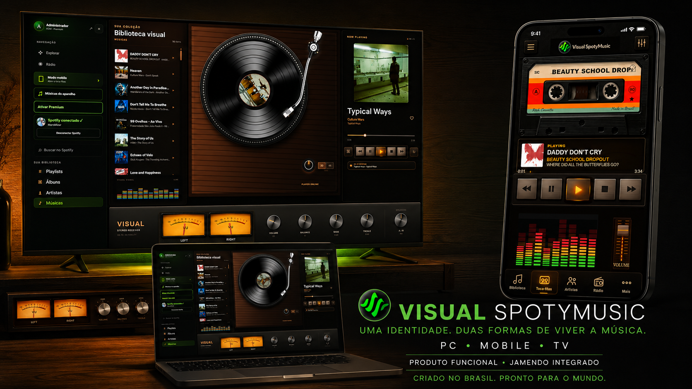

# Visual SpotyMusic

  

  <strong>Uma identidade. Duas formas de viver a música.</strong> 
  <em>One identity. Two ways to experience music.</em>

  <a href="https://visual-spotymusic-live.manomizer.chatgpt.site/?demo=1"><strong>Testar no computador</strong></a>
  ·
  <a href="https://visual-spotymusic-live.manomizer.chatgpt.site/mobile?demo=1"><strong>Testar no celular</strong></a>
  ·
  <a href="https://visual-music-premium.manomizer.chatgpt.site/"><strong>Planos e Premium</strong></a>

  <a href="docs/media/visual-spotymusic-demo.mp4"><strong>▶ Assistir ao vídeo de apresentação (16 segundos)</strong></a>

## Sobre o projeto

O Visual SpotyMusic é uma experiência musical retrô para a web:

- **no computador**, a música ganha vida em um toca-discos hi-fi;
- **no celular**, a experiência se transforma em um toca-fitas retrô;
- o usuário pode ouvir músicas locais sem enviá-las ao servidor;
- o catálogo independente do **Jamendo já está integrado**;
- o Spotify permanece opcional e sujeito às regras, ao plano Premium e à autorização da plataforma.

O projeto combina música, nostalgia e interface interativa em uma experiência diferente dos players tradicionais.

## Experimente agora

| Experiência | Link |
|---|---|
| Demonstração para computador | [Abrir modo PC](https://visual-spotymusic-live.manomizer.chatgpt.site/?demo=1) |
| Demonstração para celular | [Abrir modo Mobile](https://visual-spotymusic-live.manomizer.chatgpt.site/mobile?demo=1) |
| Aplicativo completo | [Abrir Visual SpotyMusic](https://visual-spotymusic-live.manomizer.chatgpt.site/) |
| Planos e ativação Premium | [Conhecer os planos](https://visual-music-premium.manomizer.chatgpt.site/) |

## O que já funciona

- interface de toca-discos para computador;
- interface de toca-fitas para celular;
- reprodução de músicas do próprio dispositivo;
- catálogo Jamendo;
- controles de play, pause, stop, volume e progresso;
- modo visitante e demonstrações públicas;
- ativação Premium e recuperação de licença;
- Spotify com OAuth PKCE, sem Client Secret no navegador.

## Fontes musicais e parcerias

| Fonte | Situação |
|---|---|
| Jamendo | Integrado ao projeto |
| Músicas locais | Disponível; os arquivos permanecem no dispositivo |
| Spotify | Integração opcional em processo de regularização e autorização comercial |
| Radio Browser | Planejado para rádios ao vivo |
| Deezer | API pública em avaliação para descoberta e prévias autorizadas |
| TIDAL e Qobuz | Contatos de parceria em andamento |
| Audius | Em avaliação técnica e comercial |
| Navidrome | Planejado para catálogo próprio autorizado |

O Visual SpotyMusic não hospeda nem distribui de forma independente o catálogo de serviços terceiros. Autenticação, disponibilidade e reprodução seguem as regras de cada plataforma.

## Parcerias, licenciamento e interesse comercial

Buscamos:

- usuários para testar as experiências PC e mobile;
- criadores e artistas independentes;
- estabelecimentos interessados em uma versão personalizada;
- parceiros de catálogo e distribuição;
- propostas de licenciamento, investimento ou aquisição.

[**Abrir uma conversa comercial**](https://github.com/Mizerex/visual-spotymusic/issues/new?template=commercial-interest.md)

Ao entrar em contato, informe se o interesse é em teste, parceria, licenciamento, versão personalizada, investimento ou aquisição.

## English

Visual SpotyMusic is a retro web music experience: a hi-fi turntable on desktop and a cassette player on mobile. Local files stay on the user's device, Jamendo is already integrated, and third-party services remain subject to their own authorization and playback rules.

We welcome international users, artists, catalogue partners, licensing opportunities, white-label proposals, investment conversations and acquisition interest.

- [Try the desktop demo](https://visual-spotymusic-live.manomizer.chatgpt.site/?demo=1)
- [Try the mobile demo](https://visual-spotymusic-live.manomizer.chatgpt.site/mobile?demo=1)
- [Start a business conversation](https://github.com/Mizerex/visual-spotymusic/issues/new?template=commercial-interest.md)

## Tecnologia e segurança

Projeto desenvolvido em Next.js, React e TypeScript. A conexão Spotify usa Authorization Code com PKCE e não utiliza Client Secret no código do navegador.

Arquivos locais são processados no próprio dispositivo. Nunca publique senhas, tokens, segredos ou credenciais em issues.

## Código e direitos

Este repositório apresenta o desenvolvimento técnico do Visual SpotyMusic. A ausência de uma licença de código aberto não concede autorização para copiar, redistribuir, vender ou criar produtos derivados. Marcas, identidade visual, recursos e código permanecem reservados aos seus titulares.

---

Criado no Brasil por **Manoel Erculano**.
